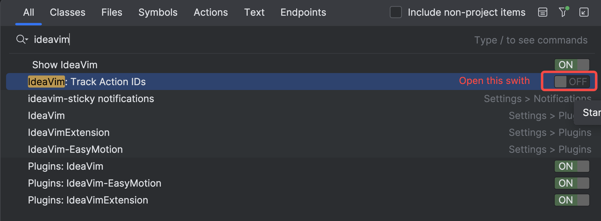
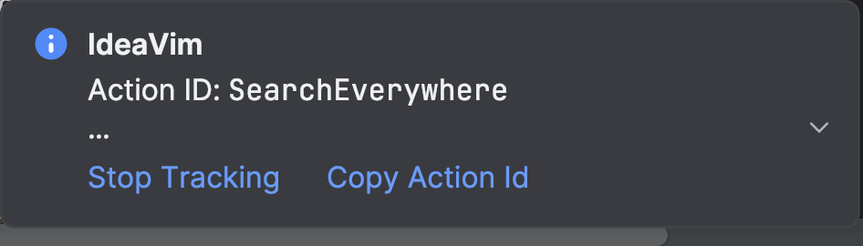

## Plugin Prepare

IDEA Install the following plug-ins:

- IdeaVim
- IdeaVim-EasyMotion
- IdeaVimExtension
- AceJump

## How to get the IDEA action id

### Method 1

You can use the `:actionlist` command in vim to list all IDEA actions, then you can configure the vim shortcut according to your needs.

### Method 2(Reconmmend)

You can double click shift in IDEA -> search 'ideavim' -> open the 'Track Action IDs' switch, and then you will find that all the actions you do in idea will show the corresponding action id in the lower right corner

## Reference

- [https://github.com/JetBrains/ideavim/discussions/303](https://github.com/JetBrains/ideavim/discussions/303)
- [https://cloud.tencent.com/developer/article/2158218](https://cloud.tencent.com/developer/article/2158218)
- [https://youtrack.jetbrains.com/issue/VIM-25/VIM-code-paste-should-be-smarter](https://youtrack.jetbrains.com/issue/VIM-25/VIM-code-paste-should-be-smarter)
